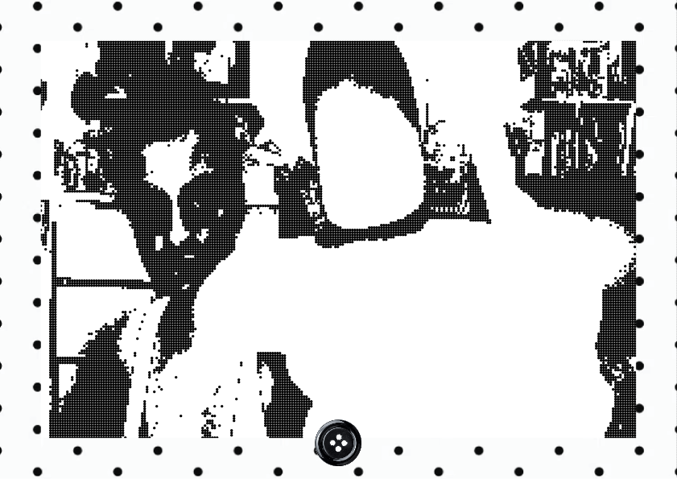

# AI DISCLAIMER : I CODED EVERYTHING MYSELF but I did use AI for research purposes, including for researching code.
# DEVELOPED FINAL TASK
## What did I chose to develop and why ?
I chose to develop the weekly task from Week 6 :
Creating a photobooth app. This is because I wanted to approach creating an app that can be vissually pleasing to look at. I started with an idea to have a decorative frame, a cute button and the webcam in the center. I wanted to give it a cute visual filter.

Started off with the frame, using Adobe llustrator and clipping masks :

  

## I then decided to add a sewing button as a button for when you take a photo

  

# So far this is what a frame looks like :

  

## I wanted to include more elements that made it interactive so I decided to make the button spin (no sound for video needed)

<video src="Photobooth_outcome.mov" width="640" height="360" controls></video>

I then tried to add some smile tracki gfeatures implemented. After referring to Processing's official librairies concerning the matter, I found. myself a rythm. But then I quickly got lost so I was basically nowhere. That is when I used VS Codes' built in AI to help me with the functions. It as lengthy and complicated.
It kept inputting empty functions, disbaling the SMile detection module I implemented, so I decided to scrap the whole thing.
I then decided to replace this whole idea by combining it with the wekly task related to sound and oscillation : wheneer the user clicks the button a sound plays.
 
At the end of this text is my result so far
This developped taks is based originally based off the first photobooth task I developped. However, that task was about experimental visuals adn how I can play with them. The way i developped it further wsas by coding an enemble that is way more visually pleasing to expeience, but also fully functional. The original Zendaya based one was not obvious about the controls needed to be put in use (such as the ENTER button needed to take a photo). This developpped task suggests imporvements in temrs of interaction design, for example, in the final outcome, there is not only a button that has been created but it rotates. This transfomration suggests/ invites the user to interact with it. Not only that but the general aesthetics are way mroe impactful and are more inviting to the user, suggesting that people are more likely to use it and take it more seriously. That with the sound function that has been added, it really ties together an app that seems complete and almost professional, with a cute aesthetic.

<video src="IMG_3659.MOV" width="640" height="360" controls></video>

# Further development 
after all of this, I thoght it simply was not enough, it wwas not far different from the weekly task demanded from us in class. So then I got to wondering, how can I develop this task futherthrough interaction design ? I looked up some librairies that ould be useful through google and also through AI.
I came accross the idea of using computer vision and face tracking on this website https://medium.com/analytics-vidhya/computer-vision-and-image-processing-with-opencv-8868876618c3

This is when I finally got the idea createa photobooth that once a phoobooth app that takesa. photo when the user blinks.

After much trial and error to which Gemini guided me through, fixing my typos and bugs. I ende dup wih an outcomem that actually did not consisted of using the ASCII dithering. This was because It was more inconvenient  than usefuul. It was good for the aesthtic but it made it harder for the code to understand when the user is blinking. I ended up using the Open CV librairi'es face tracking feature quite a bit. I ended up keeping the sound effect for when each photo is taken using the sound porcessing librairy from before.

## Outcome :
### From the video below you should be able to see me blinking, once I blink the frame is captured ( as indicated by the sound effect). There is also a feature in the UI, for when the computer does not detetc a face it asks you to smile at the camera.
<video src="OutcomePhotobooth.mov" width="640" height="360" controls></video>
<video src="Photooutcome2.mov" width="640" height="360" controls></video>
