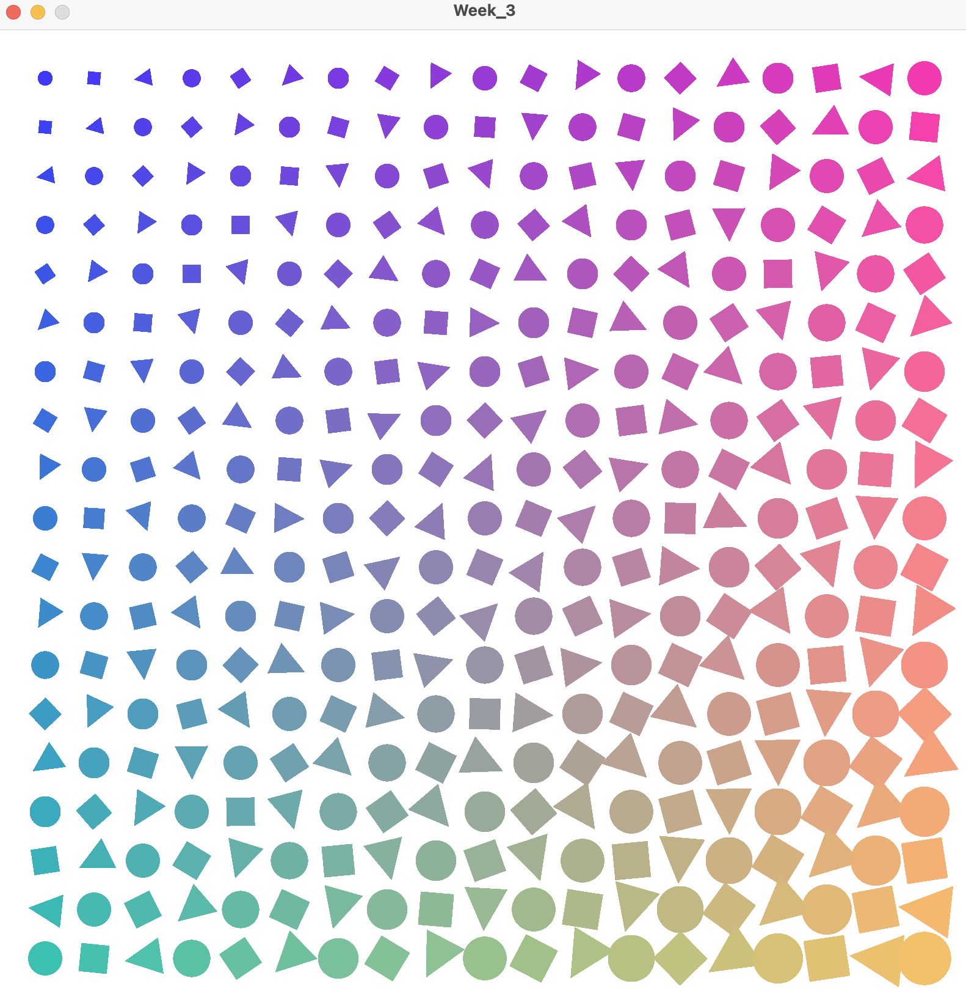

# Week 3 

# DISCLAIMER : NO AI WAS USED

# Instructions : 
## Week 3 Portfolio Task

Using Processing, make an abstract artwork. It should:

Use at least 3 different primitives,
Use the modulo ('%') operator to create a pattern. You can use it for example to alternate between different shapes or colours.
If you want to, you're welcome to use one of your p5 sketches as a starter. Please make sure to include a reference link if you do.

# Outcome 

## My process :
### DISCLAIMER : THIS PROJECT IS A RESULT OF AI TUTORIALS I FOLLOWED
My goal was to create a pattern againsr a white background that forms a gradient of colors. For that I neded to carefully initialize variables and for loops to draw the shapes above the rgb channels mapped underneath which determines the gradients.
 My code explained mathematically ( it helps me undedrstand the process of what I just made) :

initializing the spacing between the shpaes as a variable
intializing the count to determine the shapes sed later on as a variable

for the width and height of the canvas, the color channels ( RGB) are initialized , where the shapes are then drawn above. The sizes of the shapes are then determined by the position across the canvas. I use the pushMatrix function to retranslate the shapes' positions and then apply dradual rotatiosn for an optical illusion
The shape choice is determined by the modulo operator. The count of the chape divided ( Euclidien division) by three is equal to 0, then a circle is drawn, if 1 then a square, if 2 then a triangle. at the end of the for loop i popMatrix but also add  +1 to the count variable so it moves on to the next shape, keeping track of how many are being drawn.

 This kind of made me realise that coding graphics is basically just visually mapping channels, you use maths to determine where the underlying colors are and the shapes above them.

# In order to develop this task further, I decided to add rotating animations for the squares
This idea is a perfect example to how design once made interactive is more engaging to the viewer.
Te psychology behind it is actually due to the fct that once a user is looking at.a screen, they expect aniamtion, movement, colors. They expect stimulation, visual stimulation. So far this sketch : 
  

is NOT interactive. Nothing is moving, the colors are pretty , the image looks nice but it is not engaging. Of the user wanted to look at still life they would pick up a picture book. 
By editing my code, I managed to make it more interactive, pleasing to look at but also in a way hypnotic, like an illusion. Similar to what we did in Block 1 with Javascript.
The code makes it that not all of the shapes rotate ( the circle tehnically does but the hape is perfectly round/ symmetrical so it doesn't count), only some causing some sort of confusion / illusion to the user, tricking them into staying engaged. ( The video doesnt show up on Github website but in my repository it does through VS Code)
<video src="Outcome.mp4" width="640" height="360" controls></video>
