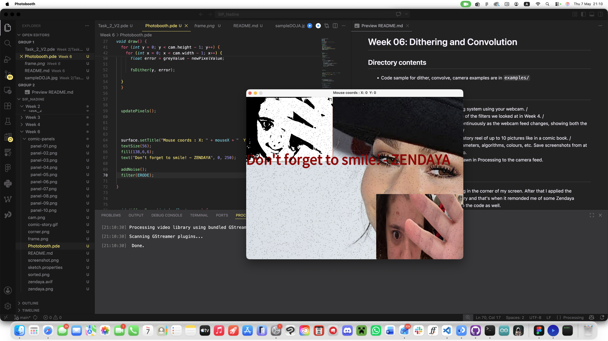
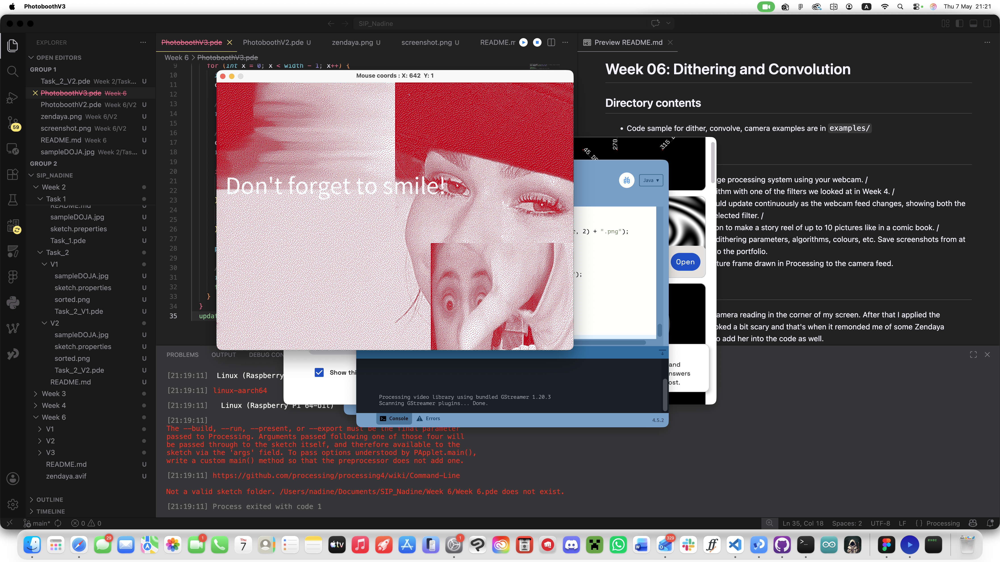
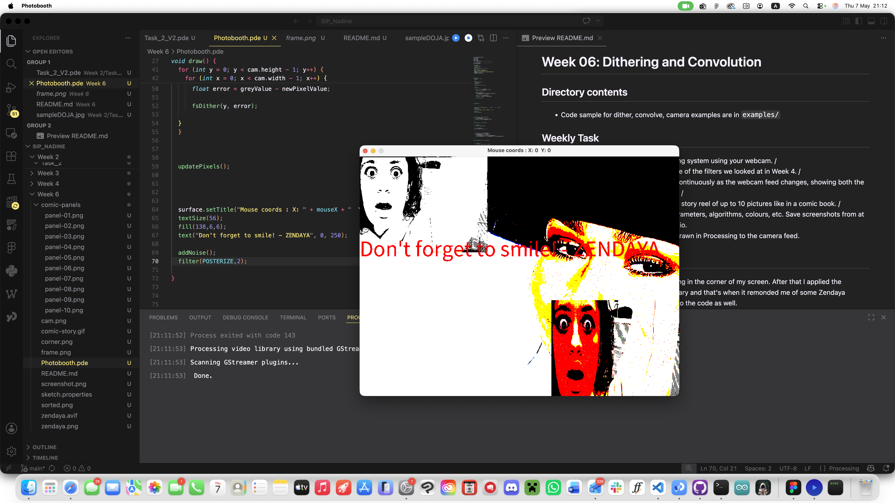

# Week 06: Dithering and Convolution

# AI DISCLAIMER : I CODED EVERYTHING MYSELF but I did use AI for research purposes, including for researching code.
#### AI DISCLAIMER : For this task I did use AI ( specifically Claude and then Gemini when I ran out of credits lol) to ask how to poceed for each step  : when I wanted to layer the dithered image in top of my webcam. The rest was researched myself, with Processnig librairies where I looked up different types of noises I can add. But i did ask it to clean up my code. But the actual coding was done myself.
## Directory contents

* Code sample for dither, convolve, camera examples are in `examples/`

## Weekly Task

- Implement a real-time image processing system using your webcam. /
- Combine a dithering algorithm with one of the filters we looked at in Week 4. /
- The processed image should update continuously as the webcam feed changes, showing both the dithering effect and the selected filter. /
- Use the saveFrame function to make a story reel of up to 10 pictures like in a comic book. /
- Experiment with different dithering parameters, algorithms, colours, etc. Save screenshots from at least 3 different versions to the portfolio.
- Optional / Extra: Add a picture frame drawn in Processing to the camera feed.

# OUTCOMES
 

## MY PROCESS

My first step was to simulate a camera reading in the corner of my screen.
After that I applied the dithering function
I thought it looked a bit scary and that's when it remonded me of some Zendaya memes. This is when I decided to add her into the code as well. 
#### AI DISCLAIMER : For this task I did use AI ( specifically Claude and then Gemini when I ran out of credits lol) to ask how to poceed for each step  : when I wanted to layer the dithered image in top of my webcam. The rest was researched myself, with Processnig librairies where I looked up different types of noises I can add. But i did ask it to clean up my code. But the actual coding was done myself.

I After I added Zendaya into the background I put one of her famous quotes : DONT FORGET TO SMILE
I added a noise filter on top and then a key bind to saving the canvas.

I basically ended up with a Zendaya horror themed photobooth.

My different versions consist of one iwth a posterised filter, one with the default outcome I came up with and one with a noise displacement resorting thingy from week 4 that i intergrated

